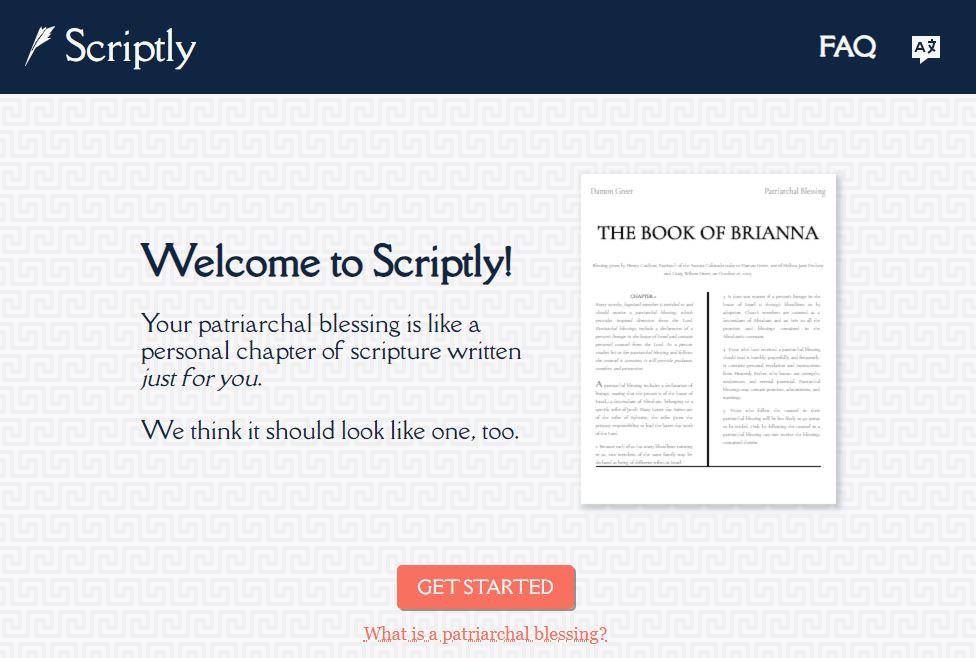

I am a member of The Church of Jesus Christ of Latter-day Saints. In my church, we are encouraged to do a lot of scripture study and annotate what we learn. All members have the opportunity to receive a patriarchal blessing, which is a personalized blessing that we see as divine guidance, almost as if it were a chapter of scripture written just for us.In that vein, I decided to create this tool so that members could have their blessings styled to look like the other pages of the scriptures. 

# The Tech

Scriptly a React site built on GatsbyJS. The current backend system is powered by two Lambda functions: the first function will create a `js~docx` file using the `js~docxtemplater` library; the second function runs a headless version of LibreOffice to convert that `js~docx` to a `js~pdf`. I decided to use a Word document template to create the documents because it was the best method I found to create the page layout with the two columns and the footnote section.

Internationalization is handled by `js~react-intl`.