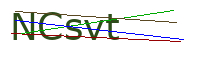

I wanted to automate some tasks on a site that I frequently use, but every now and then the site presents a captcha. I figured that with a little cleanup of the captcha images, I'd be able to use OCR (Optical Character Recognition) to read the captchas and provide the correct answer.

## The Problem with Captchas and OCR

The captcha images on the site consist of a string of five characters with various colored lines drawn through.




The letters aren't distorted and they're on a nice white background, so we shouldn't have any problem dropping them straight into an OCR program, right? Well, not quite. The problem is that these little lines are *very* effective at thwarting OCR engines because the majority of those programs rely on edge detection to identify each letter. Let's visit the [Tesseract.js site](https://tesseract.projectnaptha.com/) and try our captcha on their demo.


Instead of reading `HdFW6`, Tesseract produced `HaEWe-`; this is definitely not what we're looking for. We're going to have to clean up this image so that it doesn't confuse Tesseract.

## Cleaning up the Captchas

We need to get rid of these lines if we want Tesseract.js to stand a fair chance at reading our image. Thankfully, there's an interesting attribute of these captchas that will help us: all of the characters are a solid color, and each line is a different color. These colors change every time a new captcha is produced.

So, if we break our png down pixel by pixel and count how many of each color pixel appears, we can find

1. Which color appears most often (the white background)
2. Which color appears second most often (our characters)
3. The rest of the colors (the lines)

### Identifying the characters

Let's pull in a png library that will help us analyze the image and then break down our color count.

```js
const fs = require('fs')
const PNG = require('pngjs').PNG

// open image
const captcha = fs.readFileSync(path)
const pngImage = PNG.sync.read(captcha)

// create a dictionary to keep track of our pixel counts
let colorOccurrences = {}

let {data, height, width} = pngImage

for (let y = 0; y < height; y++) {
  for (let x = 0; x < width; x++) {
    /**
     * Each pixel is a set of 4 values:
     * Red, Green, Blue, Alpha (transparency)
     */
    let index = (width * y + x) * 4;

    // create a string of the R-G-B color values
    let color = `${data[index]}-${data[index+1]}-${data[index+2]}`
    // we can ignore white since it will always be the background
    if(color !== "255-255-255"){
      // increase the count by 1 (or set it to 1 if the color wasn't there yet)
      colorOccurrences[color] = (colorOccurrences[color] || 0) + 1
    }
  }
}
```

We first open our image as a file and pass it in to the PNG library, which gives us a `pngImage` object. This object holds all the information about our image, but we're only concerned with 3 parts: the `height`, the `width`, and the `data`.

The `data` is a 1-dimensional array of all the color information that makes up our image. Each pixel is represented by 4 values from 0-255: Red, Green, Blue, and Alpha (the transparency). So for each round of the loop, we need to multiply our index by 4 to jump to the next pixel.

For example, let's look at a 2x2 (4 pixel) image.


The `data` array for this image would be

```js
/* R     G     B     A */
[
  252,  215,  64,   255, // pixel 1 (0,0)
  64,   252,  89,   255, // pixel 2 (0,1)
  0,    180,  239,  255, // pixel 3 (1,0)
  126,  64,   252,  255  // pixel 4 (1,1)
]
```

Now that we have our data, we can loop through each pixel and grab the RGB values (we don't need the alpha value). We'll store the RGB value as a string like `js~R-G-B` to use it as a key in our `colorOccurrences` object, then keep a count of how may pixels of each color occur. We'll just ignore the white pixels since it's the background color.

Finally, we can find our color that appeared most frequently. This will correspond to the color of our characters.

```js
// grab all of the colors that we saw [R-G-B, # of occurrences]
let colors = Object.entries(colorOccurrences)
// find the color that occurred most
let highestColor = colors.reduce((highColor, currentColor) => highColor[1] > currentColor[1] ? highColor : currentColor)
// grab just the R-G-B, we don't need the number of occurrences
let highestColorRGB = highestColor[0]
```

Now that we know what color our characters are, we can preserve those while removing the unnecessary noise from the picture.

### Removing the lines

