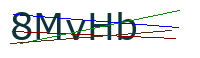
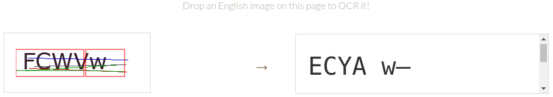
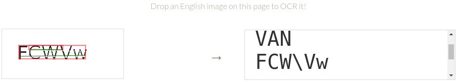

I wanted to automate some tasks on a site that I frequently use, but every now and then the site presents a captcha. I figured that with a little cleanup of the captcha images, I'd be able to use OCR (Optical Character Recognition) to read the captchas and provide the correct answer.

## The Problem with Captchas and OCR

The captcha images on the site consist of a string of five characters with various colored lines drawn through. For example, look at these three captchas.





The letters aren't distorted and they're on a nice white background, so we shouldn't have any problem dropping them straight into an OCR program, right? Well, not quite. The problem is that these little lines are *very* effective at thwarting OCR engines because the majority of those programs rely on edge detection to identify each letter. [Tesseract.js](https://tesseract.projectnaptha.com/) is one of the most popular OCR libraries for JavaScript. Let's visit their site and try our captcha on their demo.



Instead of reading `FCWVw`, Tesseract produced `ECYA w-`; this is definitely not what we're looking for. We're going to have to clean up this image so that it doesn't confuse Tesseract.

## Cleaning up the Captchas

We need to get rid of these lines if we want Tesseract.js to stand a fair chance at reading our image. Thankfully, there's an interesting attribute of these captchas that will help us: all of the characters are a solid color, and each line is a different color. These colors change every time a new captcha is produced.

So, if we break our png down pixel by pixel and count how many of each color pixel appears, we can find:

1. Which color appears most often (the white background)
2. Which color appears second most often (our characters)
3. The rest of the colors (the lines)

### Identifying the characters

Let's pull in a png library that will help us analyze the image and then break down our color count.

```js
const fs = require('fs')
const PNG = require('pngjs').PNG

// open image
const captcha = fs.readFileSync(path)
const pngImage = PNG.sync.read(captcha)
let {data, height, width} = pngImage

// create a dictionary to keep track of our pixel counts
let colorOccurrences = {}

for (let y = 0; y < height; y++) {  // rows
  for (let x = 0; x < width; x++) { // columns
    /**
     * Each pixel is a set of 4 values:
     * Red, Green, Blue, Alpha (transparency)
     */
    let index = (width * y + x) * 4;

    // create a string of the R-G-B color values
    let color = `${data[index]}-${data[index+1]}-${data[index+2]}`
    // we can ignore white since it will always be the background
    if(color !== "255-255-255"){
      // increase the count by 1 (or set it to 1 if the color wasn't there yet)
      colorOccurrences[color] = (colorOccurrences[color] || 0) + 1
    }
  }
}
```

We first open our image as a file and pass it in to the PNG library, which gives us a `pngImage` object. This object holds all the information about our image, but we're only concerned with 3 parts: the `height`, the `width`, and the `data`.

The `data` is a 1-dimensional array of all the color information that makes up our image. Each pixel is represented by 4 values from 0-255: Red, Green, Blue, and Alpha (the transparency). So for each round of the loop, we need to multiply our index by 4 to jump to the next pixel.

For example, let's look at a 2x2 (4 pixel) image.


The `data` array for this image would be

```js
/* R     G     B     A */
[
  252,  215,  64,   255, // pixel 1 (0,0)
  64,   252,  89,   255, // pixel 2 (0,1)
  0,    180,  239,  255, // pixel 3 (1,0)
  126,  64,   252,  255  // pixel 4 (1,1)
]
```

Now that we have our data, we can loop through each pixel and grab the RGB values (we don't need the alpha value). We'll store the RGB value as a string like `R-G-B` to use it as a key in our `colorOccurrences` object, then keep a count of how may pixels of each color occur. We'll just ignore the white pixels since it's the background color.

Finally, we can find our color that appeared most frequently. This will correspond to the color of our characters.

```js
// grab all of the colors in the pattern [R-G-B, # of occurrences]
let colors = Object.entries(colorOccurrences)
// find the color that occurred most
let highestColor = colors.reduce((highColor, currentColor) => {
  if(highColor[1] > currentColor[1]) {
    return highColor
  } else {
    return currentColor
  }
})
// grab just the R-G-B as an array, we don't need the number of occurrences
let highestColorRGB = highestColor[0].split('-')
```

Now that we know what color our characters are, we can preserve those while removing the unnecessary noise from the picture.

### Removing the lines

Since we know which colors we want to keep (the white background and whatever color our characters are), we can loop back through our image and repaint any pixel we see that doesn't match.

```js
for (let y = 0; y < height; y++) {      // rows
  for (let x = 0; x < width; x++) {   // columns
    let index = (width * y + x) * 4;

    // grab the RGB values of the current pixel
    let RGB = [data[index], data[index+1], data[index+2]]

    // ignore white pixels so we don't alter the background
    if (RGB[0] === 255 && RGB[1] === 255 && RGB[2] === 255) continue

  /**
   * We need to be a little forgiving when checking the colors.
   * Sometimes individual pixels are only 1-3 points of R, G, or B away,
   * especially on the edges of the characters.
   */
  // find how far each pixel color channel is from the color of the characters
    let [red, green, blue] = [
      Math.abs(highestColorRGB[0] - colorRGB[0]),
      Math.abs(highestColorRGB[1] - colorRGB[1]),
      Math.abs(highestColorRGB[2] - colorRGB[2])
    ]

    // if any color channel is more than 3 points away
    if (red > 3 || green > 3 || blue > 3){
      // paint the pixel...
    }
  }
}
```

We set up a loop again, row by row and column by column, and grab the RGB values of the current pixel. We'll ignore any white pixel because we want to leave the background alone. Then, we check to see if the current pixel's color matches the color of the characters.

We have to leave a little leeway for each color check; sometimes there's a discrepancy of 1-3 points on each color channel between adjacent pixels, especially around the edges of the characters. So the main color might be `10-30-59`, but one of the pixels on the character might be `11-29-57`. We'll let these close pixels slide by unscathed. If we see that any color channel is more than 3 points off, we'll paint the pixel to get rid of the line. But what color do we paint the pixel?

The first option that comes to mind is to just erase the lines by painting each pixel white like the background.

```js
// if any color channel is more than 3 points away
if (red > 3 || green > 3 || blue > 3){
  data[index] = 255;
  data[index + 1] = 255;
  data[index + 2] = 255;
}
```
This will produce the following image.


Not too bad! Let's see what happens when we pass this to Tesseract.



Uh oh. 😕 This time, Tesseract read `VAN FCW\Vw`. While the captcha looks a lot cleaner to us, we've actually created a lot of new edges which confuses Tesseract. Let's take a different approach.

Instead of painting the pixels white and leaving holes in our characters, we can try to fill in the gaps instead. The simplest thing we can do is just paint our current pixel the same color as the one above it.

```js
// if any color channel is more than 3 points away
if (red > 3 || green > 3 || blue > 3){
  // Grab the pixel that is one row up (y-1)
  let aboveIndex = (width*(y-1) + x) * 4

  // Paint our pixel to match the pixel above
  data[index] = data[aboveIndex];
  data[index + 1] = data[aboveIndex + 1];
  data[index + 2] = data[aboveIndex + 2];
}
```

With this new technique, we get:


We still get some odd drips and artifacts, but this looks a lot better! Let's see what Tesseract thinks about our new version.


A perfect success! By eliminating extra edges and solidifying our characters, we've cleaned up the captcha enough to give Tesseract a fighting chance.

## Conclusion

By cleaning up the lines crossing through our captcha, we were able to use the Tesseract.js OCR library to decode the captchas and allow for a bit more automation. And who doesn't love some more automation in their life?

Here's the full code:

```js
const fs = require('fs')
const PNG = require('pngjs').PNG

// open image
const captcha = fs.readFileSync(path)
const pngImage = PNG.sync.read(captcha)
let {data, height, width} = pngImage

// create a dictionary to keep track of our pixel counts
let colorOccurrences = {}

for (let y = 0; y < height; y++) {  // rows
  for (let x = 0; x < width; x++) { // columns
    /**
     * Each pixel is a set of 4 values:
     * Red, Green, Blue, Alpha (transparency)
     */
    let index = (width * y + x) * 4;

    // create a string of the R-G-B color values
    let color = `${data[index]}-${data[index+1]}-${data[index+2]}`
    // we can ignore white since it will always be the background
    if(color !== "255-255-255"){
      // increase the count by 1 (or set it to 1 if the color wasn't there yet)
      colorOccurrences[color] = (colorOccurrences[color] || 0) + 1
    }
  }
}

for (let y = 0; y < height; y++) {      // rows
  for (let x = 0; x < width; x++) {   // columns
    let index = (width * y + x) * 4;

    // grab the RGB values of the current pixel
    let RGB = [data[index], data[index+1], data[index+2]]

    // ignore white pixels so we don't alter the background
    if (RGB[0] === 255 && RGB[1] === 255 && RGB[2] === 255) continue

  /**
   * We need to be a little forgiving when checking the colors.
   * Sometimes individual pixels are only 1-3 points of R, G, or B away,
   * especially on the edges of the characters.
   */
  // find how far each pixel color channel is from the color of the characters
    let [red, green, blue] = [
      Math.abs(highestColorRGB[0] - colorRGB[0]),
      Math.abs(highestColorRGB[1] - colorRGB[1]),
      Math.abs(highestColorRGB[2] - colorRGB[2])
    ]

    // if any color channel is more than 3 points away
    if (red > 3 || green > 3 || blue > 3){
      // if any color channel is more than 3 points away
      if (red > 3 || green > 3 || blue > 3){
        // Grab the pixel that is one row up (y-1)
        let aboveIndex = (width*(y-1) + x) * 4

        // Paint our pixel to match the pixel above
        data[index] = data[aboveIndex];
        data[index + 1] = data[aboveIndex + 1];
        data[index + 2] = data[aboveIndex + 2];
      }
    }
  }
}

// save new image
const imageBuffer = PNG.sync.write(pngImage)
fs.writeFileSync(`captcha-clean.png`, imageBuffer)
```
