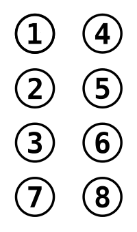

I stumbled upon an [article from Terence Eden](https://shkspr.mobi/blog/2020/12/a-qr-code-built-from-emoji/) in which he and a friend contemplated a method for sending QR codes via a text-only medium such as Twitter. They landed on sending the QR code as black and white emoji squares, like so:

<div style="line-height:0.9em;letter-spacing:-6px;">
⬜️⬜️⬜️⬜️⬜️⬜️⬜️⬜️⬜️⬜️⬜️⬜️⬜️⬜️⬜️⬜️⬜️⬜️⬜️⬜️⬜️⬜️⬜️
⬜️⬛️⬛️⬛️⬛️⬛️⬛️⬛️⬜️⬜️⬜️⬛️⬜️⬜️⬜️⬛️⬛️⬛️⬛️⬛️⬛️⬛️⬜️
⬜️⬛️⬜️⬜️⬜️⬜️⬜️⬛️⬜️⬛️⬛️⬜️⬛️⬛️⬜️⬛️⬜️⬜️⬜️⬜️⬜️⬛️⬜️
⬜️⬛️⬜️⬛️⬛️⬛️⬜️⬛️⬜️⬜️⬛️⬜️⬛️⬛️⬜️⬛️⬜️⬛️⬛️⬛️⬜️⬛️⬜️
⬜️⬛️⬜️⬛️⬛️⬛️⬜️⬛️⬜️⬛️⬛️⬜️⬛️⬛️⬜️⬛️⬜️⬛️⬛️⬛️⬜️⬛️⬜️
⬜️⬛️⬜️⬛️⬛️⬛️⬜️⬛️⬜️⬜️⬜️⬛️⬜️⬜️⬜️⬛️⬜️⬛️⬛️⬛️⬜️⬛️⬜️
⬜️⬛️⬜️⬜️⬜️⬜️⬜️⬛️⬜️⬛️⬛️⬛️⬛️⬛️⬜️⬛️⬜️⬜️⬜️⬜️⬜️⬛️⬜️
⬜️⬛️⬛️⬛️⬛️⬛️⬛️⬛️⬜️⬛️⬜️⬛️⬜️⬛️⬜️⬛️⬛️⬛️⬛️⬛️⬛️⬛️⬜️
⬜️⬜️⬜️⬜️⬜️⬜️⬜️⬜️⬜️⬜️⬜️⬛️⬜️⬛️⬜️⬜️⬜️⬜️⬜️⬜️⬜️⬜️⬜️
⬜️⬛️⬛️⬛️⬛️⬛️⬜️⬛️⬛️⬛️⬛️⬜️⬛️⬛️⬛️⬜️⬛️⬜️⬛️⬜️⬛️⬜️⬜️
⬜️⬜️⬜️⬜️⬜️⬜️⬜️⬜️⬛️⬛️⬛️⬛️⬛️⬜️⬛️⬜️⬛️⬛️⬛️⬛️⬛️⬛️⬜️
⬜️⬛️⬛️⬜️⬜️⬜️⬜️⬛️⬛️⬜️⬜️⬛️⬛️⬛️⬛️⬜️⬜️⬜️⬜️⬛️⬛️⬜️⬜️
⬜️⬛️⬜️⬜️⬜️⬜️⬛️⬜️⬜️⬛️⬛️⬜️⬜️⬜️⬛️⬜️⬜️⬛️⬛️⬛️⬜️⬜️⬜️
⬜️⬜️⬛️⬜️⬛️⬛️⬛️⬛️⬛️⬛️⬛️⬛️⬛️⬜️⬜️⬛️⬜️⬛️⬛️⬜️⬜️⬛️⬜️
⬜️⬜️⬜️⬜️⬜️⬜️⬜️⬜️⬜️⬛️⬛️⬜️⬜️⬜️⬛️⬜️⬛️⬛️⬛️⬛️⬜️⬛️⬜️
⬜️⬛️⬛️⬛️⬛️⬛️⬛️⬛️⬜️⬛️⬜️⬜️⬜️⬛️⬜️⬜️⬛️⬜️⬜️⬛️⬛️⬜️⬜️
⬜️⬛️⬜️⬜️⬜️⬜️⬜️⬛️⬜️⬜️⬛️⬛️⬜️⬛️⬛️⬜️⬜️⬛️⬛️⬛️⬜️⬜️⬜️
⬜️⬛️⬜️⬛️⬛️⬛️⬜️⬛️⬜️⬛️⬛️⬛️⬛️⬛️⬜️⬛️⬜️⬛️⬛️⬜️⬜️⬜️⬜️
⬜️⬛️⬜️⬛️⬛️⬛️⬜️⬛️⬜️⬛️⬜️⬜️⬛️⬜️⬛️⬜️⬛️⬛️⬜️⬛️⬛️⬜️⬜️
⬜️⬛️⬜️⬛️⬛️⬛️⬜️⬛️⬜️⬛️⬜️⬜️⬛️⬛️⬛️⬜️⬛️⬜️⬜️⬛️⬜️⬜️⬜️
⬜️⬛️⬜️⬜️⬜️⬜️⬜️⬛️⬜️⬛️⬛️⬜️⬜️⬜️⬛️⬜️⬛️⬛️⬜️⬛️⬜️⬜️⬜️
⬜️⬛️⬛️⬛️⬛️⬛️⬛️⬛️⬜️⬛️⬛️⬜️⬛️⬜️⬜️⬛️⬛️⬛️⬛️⬜️⬛️⬜️⬜️
⬜️⬜️⬜️⬜️⬜️⬜️⬜️⬜️⬜️⬜️⬜️⬜️⬜️⬜️⬜️⬜️⬜️⬜️⬜️⬜️⬜️⬜️⬜️
</div>

The benefit of sending the QR code this way is that it is scannable via a phone immediately! But there are some downsides:
- Here, I was able to adjust the line and character spacing with CSS to remove as much space between the emoji as possible. This is not possible on a 3rd party platform, which would interfere with scanning the code.
- The minimum size of a QR code is a 21x21 block, or 441 characters. This is much too big for the current tweet limit of 280 characters. You'd have to use a [Micro QR code](https://barcodeguide.seagullscientific.com/Content/Symbologies/Micro_QR_Code.htm) (starting at 11x11) or an [Aztec code](https://barcodeguide.seagullscientific.com/Content/Symbologies/Aztec_Code.htm) (starting at 15x15).

However, if we concede to not being able to immediately scan the QR code when sending it via text, it opens up other avenues for encoding it. What came to mind for me was using Braille unicode characters! Each Braille character is a 2x4 grid, which means that we can compress a QR code down by a factor of 8.

```bash
⡏⡭⠭⡍⣟⢫⠛⡏⡭⠭⡍⡇
⡇⠧⠤⠇⡗⡊⡒⡇⠧⠤⠇⡇
⡯⢭⣭⡯⢉⡑⠡⢹⣙⡙⢙⡇
⡷⠽⠭⠬⡅⣨⡽⣪⢃⡐⢏⡇
⡇⡏⠉⡇⡏⣤⠡⢪⢃⡔⣻⡇
⠧⠭⠭⠥⠧⠼⠽⠮⠤⠵⠽⠇
```

## Caveats
Now, in a perfect world, we'd get to use that 8-times compression to its fullest extent. Unfortunately, Braille characters count as 2 characters in Twitter's character count. New lines also each count as a character.

How big of a Braille QR code can we fit then with these limitations? With some quick back of the napkin math, our upper limit can be expressed by $2(x^2) + x = 280$, which  comes out to a little over 11. This means that at most, we can tweet an 11x11 Braille grid, giving us a maximum size of a 22x22 QR code. This is better than the emojis, but still rather limited in terms of data density.

For a more in-depth dive into encoding lots of data into a tweet, check out the work done by [qntm](https://qntm.org/twitcodings) and the library [base2048](https://github.com/qntm/base2048).

## Converting a QR code to Braille characters
To get started, let's take a look at how Braille characters are handled in unicode.



Each Braille character is made up of 8 dots, with each dot assigned a position 1-8. If a dot is present, it's represented as a 1, otherwise a 0. This data is then stored in a binary string, from position 8 down to 1. For example, the character `⢃` has dots in spots 1, 2, and 8. So the binary string would be `10000011`.

To get the unicode character from the binary string, we first convert the binary to a hex value, then add an offset of `0x2800`. Working with hex and binary values in JavaScript requires casting values back and forth from integers to strings in order to do the base conversions.

```js
const hex = parseInt(parseInt(binary, 2).toString(16), 16)
const address = hex + 0x2800
```

Once we have our unicode address, we can get our Braille character.

```js
const character = String.fromCodePoint(address)
```

We can wrap this up into a function:

```js
const binaryToCharacter = binary =>
  String.fromCodePoint(parseInt(parseInt(binary, 2).toString(16), 16) + 0x2800)
```

### Encode the QR code
So if we have a QR code as an two-dimensional array of 1s and 0s, 1s being white and 0s being black, we can loop through the array and convert each 2x4 block into a Braille character.

It is very likely that part of some of the blocks will fall outside of the QR code. We can just set any of these as 0s.

```js
const qr = [
  [1,1,1,1,1,1,1,1],
  [1,0,0,0,1,1,0,1],
  ...
]

const braille = []

  for (let r = 0; r < qr.length; r += 4) {
    const row = []
    for (let c = 0; c < qr[r].length; c += 2) {
      const binary =
        `${qr[r + 3]?.[c + 1] ?? 0}` +  // 8
        `${qr[r + 3]?.[c] ?? 0}` +      // 7
        `${qr[r + 2]?.[c + 1] ?? 0}` +  // 6
        `${qr[r + 1]?.[c + 1] ?? 0}` +  // 5
        `${qr[r]?.[c + 1] ?? 0}` +      // 4
        `${qr[r + 2]?.[c] ?? 0}` +      // 3
        `${qr[r + 1]?.[c] ?? 0}` +      // 2
        `${qr[r]?.[c] ?? 0}`            // 1

      const characterCode = binaryToCharacter(binary)
      row.push(characterCode)
    }
    braille.push(row)
  }
```

We now have a two-dimensional array of Braille characters! We can print this to the console as follows:

```js
braille.map(row => row.join('')).join('\n')
```

### Decode the Braille QR code
So now that we've encoded our QR code as Braille and sent it over the wire, we can decode it to get back our original code.

We'll split the string back up into a 2d array, create an empty 2d array that's twice as wide and 4 times as long, then expand each Braille character into the 8 spots it corresponds to.

```js
// Split Braille string into 2d array
const message = `
⡏⡭⠭⡍⣟⢫⠛⡏⡭⠭⡍⡇
⡇⠧⠤⠇⡗⡊⡒⡇⠧⠤⠇⡇
⡯⢭⣭⡯⢉⡑⠡⢹⣙⡙⢙⡇
⡷⠽⠭⠬⡅⣨⡽⣪⢃⡐⢏⡇
⡇⡏⠉⡇⡏⣤⠡⢪⢃⡔⣻⡇
⠧⠭⠭⠥⠧⠼⠽⠮⠤⠵⠽⠇
`
const braille = message
  .split('\n')               // split into rows
  .map(row => row.split('')) // split each row into characters
  .filter(row => row.length) // remove any empty rows
```

Next, we create our new empty 2d array that will be the size of our original QR code. We'll set all the values to 0 initially; QR codes don't have any black borders, so this will allow us to later clean up any of those extra rows or columns we may have added when the Braille ran over the edges.

```js
let qr = new Array(braille.length * 4)
    .fill(0)
    .map(() => new Array(braille[0].length * 2).fill(0))
```

Now, we expand each Braille character into it's original 8 spots.

```js
// a helpful function to get our binary string back
const characterToBinary = (character) =>
  (character.codePointAt(0) - 0x2800).toString(2).padStart(8, '0')

braille.forEach((row, rowIndex) => {
    row.forEach((character, charIndex) => {
      const r = rowIndex * 4
      const c = charIndex * 2
      const binary = characterToBinary(character)
      qr[r][c] = +binary[7]
      qr[r + 1][c] = +binary[6]
      qr[r + 2][c] = +binary[5]
      qr[r][c + 1] = +binary[4]
      qr[r + 1][c + 1] = +binary[3]
      qr[r + 2][c + 1] = +binary[2]
      qr[r + 3][c] = +binary[1]
      qr[r + 3][c + 1] = +binary[0]
    })
  })
```

Finally, we can clean up any empty rows and columns. By using `flatMap`, we can return less elements than were originally in the array in case we get rid of any rows.

```js
qr = qr.flatMap(row => {
    let newRow = row
      .join('')
      .replaceAll(/0*$/g, '')
      .split('')
      .map(num => +num)
    return newRow.length ? [newRow] : []
  })
```

And there we are! Back to our 2d QR array of 1s and 0s. While this is entirely useless, it's a fun application of some handy unicode characters!
