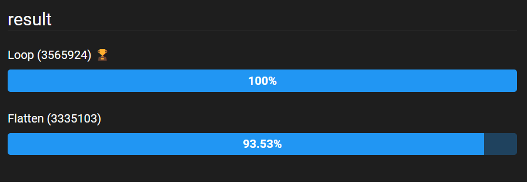
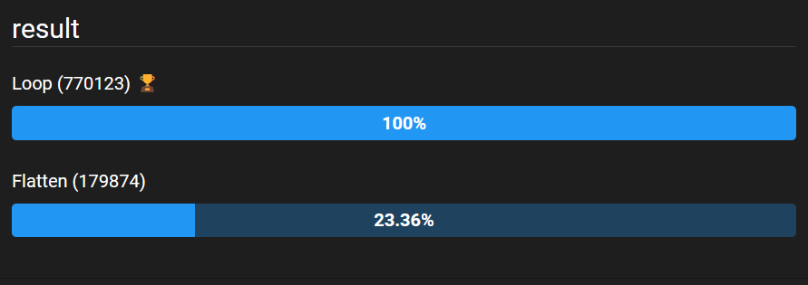

While working on a coding challenge that [@cassidoo](https://twitter.com/cassidoo) sent out in her [latest newsletter](https://buttondown.email/cassidoo/archive/nature-does-not-hurry-yet-everything-is/), I needed to find the coordinates of a particular number in a two-dimensional array of numbers. Here's a quick method for doing so!

## Finding the coordinates using loops
Let's assume that we have a 3x3 array of numbers, and we want to find the location of the number '5'. I've arbitrarily assigned the axes `x` and `y` here.

```ts
const grid = [
---> y
|  [8,6,7],
|  [5,3,0],
v  [9,1,2]
x
]
```

While it may be a simple approach, looping through our array is a straightforward way to find our target element. Check out the function below:

```ts
const find2dCoordinates = <T>(
  grid: T[][],
  target: T
): {x: number, y: number} => {
  let coords = {x: -1, y: -1}
  grid.every((row, i) => row.every((item, j) => {
    if (item === target) {
      coords = {x: i, y: j}
      return false
    }
    return true
  }))
  return coords
}
```

We first define a set of coordinates: `ts~let coords = {x: -1, y: -1}`; since we know we'll never have negative coordinates with an array, we can know that we ran into an error if the returned object has negative values.

Next, we're going to loop through each item in each row. Since we want the indices as well as the items themselves, we use the `ts~.every()` function instead of `ts~for...of` loops. We then check if each item is equal to our target. If you had an array of objects instead of numbers, you'd want to use some other equality check here.

Now, when we find a match, we store the coordinates in our `ts~coords` variable. But we have a slight problem! Since we're not using `ts~for...of` loops, we can't use a `break` to jump out of our loops early. 😕 Have no fear, because we planned for this 😎 By using `ts~.every()` instead of `ts~.forEach()`, we have an escape hatch. The `ts~.every()` function will evaluate your condition against each item in an array until it finishes the array, at which point it returns `ts~true`, or until it finds an item that fails, at which point it returns `ts~false`. So we return `ts~true` ourselves until we find the item we're looking for, then we return `ts~false`, which causes `ts~every()` to jump out early, and which bubbles up the the other `ts~.every()` function as well. Success!

## What about a flattened array?
Sometimes, we may have a two-dimensional array that has been flattened into one dimension. If you've ever worked with PNG images before, this is how their pixel information is stored. So our grid from earlier would be `ts~[8,6,7,5,3,0,9,1,2]`. How can we find our coordinates now?

First, let's find the index of the number we're looking for. Then, if we know the original length of each row, we can calculate the coordinates it would have had!

```ts
export const find2dCoordinatesFlattened = <T>(
  grid: T[],
  target: T,
  rowLength: number
): {x: number, y: number} => {
  const position = grid.findIndex(item => item === target)
  return {
    x: Math.floor(position / rowLength),
    y: position % rowLength
  }
}
```
We first use the `ts~.findIndex()` function to find the index of our target item in the one dimensional array. Then, we use two tricks to find the x and y coordinates. By dividing the index we found by the original row length and rounding down, we can find which row the item belongs on. Then, if we use the modulo operator on the index with the row length, we can see which column it belongs to.

## Final thoughts
This was a fun little project, and I recommend you take a shot at the puzzle from the [newsletter](https://buttondown.email/cassidoo/archive/nature-does-not-hurry-yet-everything-is/) I mentioned in the intro!

Also, you might have asked yourself if flattening the array ourselves and using the second method might be faster than the first method of loops. Check out these benchmarks results comparing both methods.

First, I ran it on a very small 2x3 array.


Pretty comparable scores! But then I ran it against a 50x10 array.


Yikes 😬 Flattening it ourselves falls way behind. This makes sense, though, as we have to manipulate the entire array first to flatten it, while the loops can simply dive right in and jump out early when they find the result.
