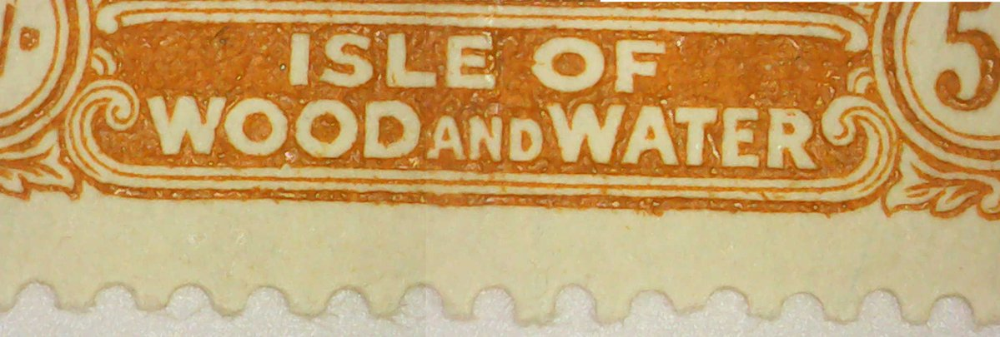

Released in 1921 as part of a series of Pictorial stamps, this 5 shilling stamp is one of the only stamps in the series that doesn't depict a scene from Jamaican history or a monument.

Sir Leslie Probyn, the governor of Jamaica, came up with the idea for this stamp. It was then drawn by Frances Wiehen, who was the daughter of Frank Cundall, the Secretary of the Institute of Jamaica.

At the bottom of the stamp frame, there's a banner that says "Isle of Wood and Water." The original inhabitants of Jamaica, the Arawaks (also known as the Taínos), gave the island the name Xaymaca, which means "land of wood and water".

The Arawaks were killed off by disease and attack when Columbus and other Spanish settlers laid claim to the island in 1494. (See Jamaica Scott #93)

In the middle of the scene sits a creature playing a pan flute, who is none other than the Greek god Pan. He represents nature and is present here to emphasize the "wood" of the island's title. He also represents the cheery attitude of the Jamaican people.

At the top of the scene is the constellation Aquarius, the water-bearer, which represents the "water" of the island. Some of the constellation is obscured by the trees, but it let's us know that we're facing east.

## References
- [Edition 16 of the Jamaica Philatelist magazine from 1942](http://jamaicaphilately.info/jamaica-philatelist)
- Jamaica: Its Postal History, Postage Stamps, and Postmarks (1928)

