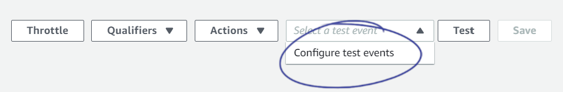
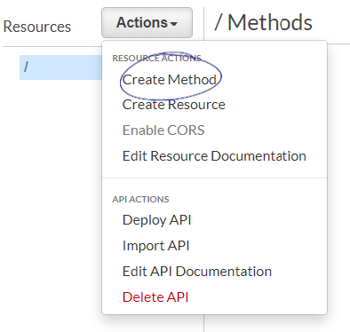
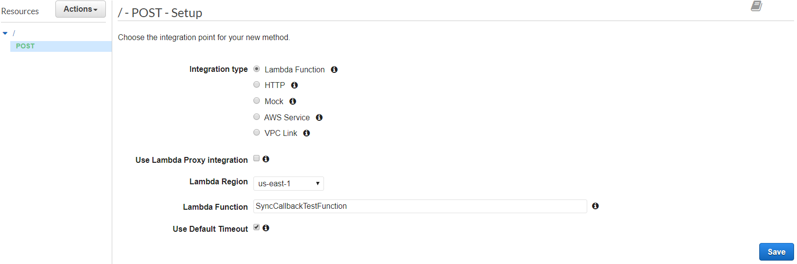
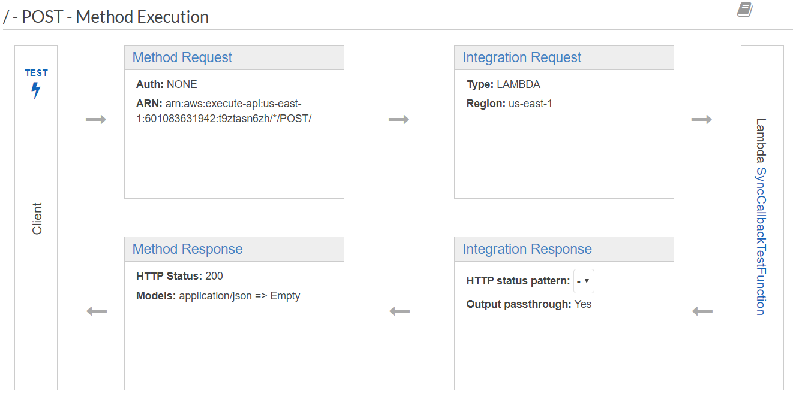
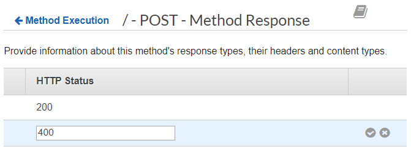
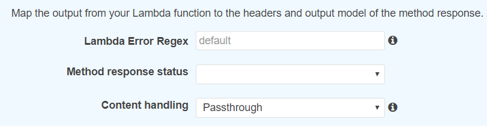
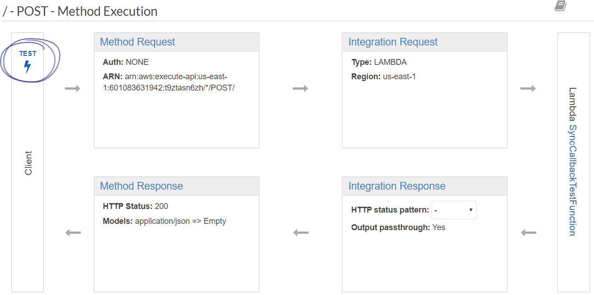
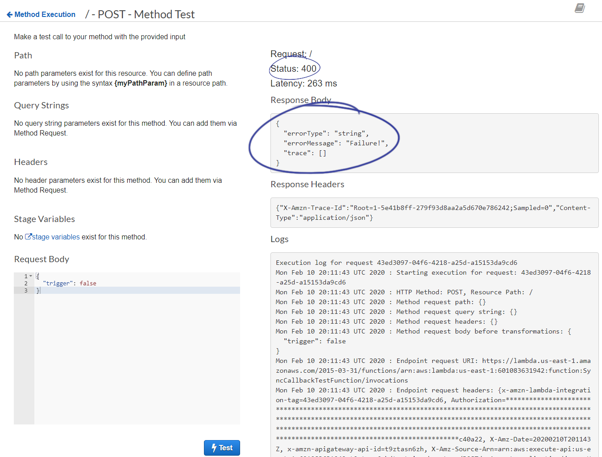
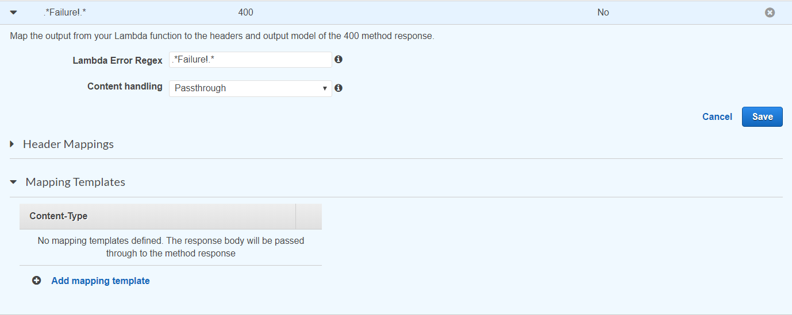
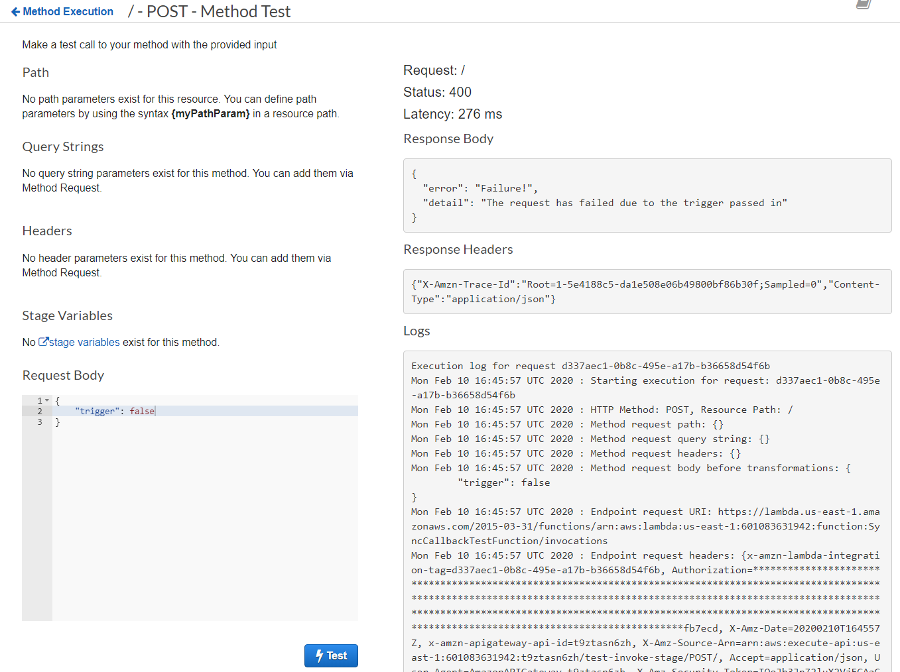

# Error Handling in API Gateway with AWS Lambda

For a recent project, I set up a lambda function that would hydrate a template using data posted to it through API Gateway. The template name would be specified in the request, which means I needed to send back some errors if anything went wrong, such as the template not being found.

These errors are handled differently in async and non-async functions. We will go over those in detail below, then look at how to catch those errors in the Gateway and return the correct API response.

# Setup

We can prepare two test events in the Lambda console to trigger errors and successful runs. Create a new lambda function using Node.js 12. You can leave the default execution role. Once the function is created, you will see options at the top right of the page. Choose to configure test events.



Create two test events using the code snippets below.

Success

```js
{
  "trigger": true
}
```

Failure

```js
{
  "trigger": false
}
```

We can now manually trigger successes and failures very easily using our test events. Let's set up our functions.

## Async Lambda Function Errors

Async functions allow for errors and results to be returned using `js~throw` and `js~return`, respectively. The following sample function demonstrates this functionality.

```js
exports.handler = async event => {
  let result = await new Promise((resolve, reject) => {
    if (event.trigger) {
      resolve(`Success!`)
    } else {
      throw `Failure!`
      // reject(`Failure!`) This will also bubble up as an error!
    }
  })
  return result
}
```

Alternatively, you can return a Promise from an async function, and the lambda function will automatically handle  `js~resolve` and `js~reject` for responses and errors.

```js
exports.handler = async event => {
  return new Promise((resolve, reject) => {
    if (event.trigger) {
      resolve(`Success!`)
    } else {
      reject(`Failure!`)
    }
  })
}
```

## Non-Async Lambda Function Errors

Handling responses and errors in non-async functions comes down to `js~context` and `js~callback`, two parameters passed in to the handler functions. The original way to return a response or error was using `js~context.succeed()` and `js~context.fail()`. This, although still functional, was superseded by `js~callback()` once AWS added support for Node 4.3.2. These are implemented as follows:

### Context Method

```js
exports.handler = (event, context) => {
  if (event.trigger) {
    /* outdated but included for compatibility */
    context.succeed(`Success!`)
  } else {
    /* outdated but included for compatibility */
    context.fail(`Failure!`)
  }
}
```

### Callback Method

```js
exports.handler = (event, context, callback) => {
  if (event.trigger) {
    /* the first parameter is for errors, so we pass null for a success */
    callback(null, `Success!`)
  } else {
    callback(`Failure!`)
  }
}
```

## API Gateway Error Mapping

Now that we have our errors propagating correctly from our Lambda functions, we can catch those errors and map them to HTTP responses. First, create a new REST API. We can leave default settings and add a name and description. Next, we'll add a POST method to it by choosing Add Method from the Actions menu, then choosing POST.



Once we click the check mark, we'll see a setup screen. We can choose any of our Lambda functions for the integration (leave Lambda proxy integration unchecked!).



Once the method is created, we'll see a screen that will show us the flow of our method.



First, we'll choose the bottom-left box that says Method Response. Here we can add a response (an HTTP response code) that our method will be able to send back. Add 400 as a response and click the check box to save changes.

Click Method Execution at the top of the screen to return to the previous overview.



We'll now be able to add the actual mapping of the error we throw in the lambda function to the 400 HTTP code we added! Click on the bottom-right box, the Integration Response. When we add an integration response here, we'll be presented with three boxes.



The first box will be a regular expression to match the error code we throw back. Let's set our regular expression to check for our error "Failure!". We'll need to add a wildcard in front as the error will be inside of a JSON object, and will thus have other characters in front of it. `regex~.*Failure.*`

API Gateway won't run these checks against successful responses! If your lambda doesn't throw an error, it will pass through as a 200 response. You can gain a bit more control over this with Lambda Proxy Integration.

We can now choose the 400 error code from the dropdown and save our changes.

## Test It Out

That's it for the setup! We can now test out our error mapping. On the overview screen, we see the leftmost box marked Test.



On the test page, we are given a box to provide a test body. We can use the same bodies that we used for the lambda function test cases. Add the failure request body and click Test. Your result will pop up on the right side of the screen.



Congrats! You've successfully set up error mapping in API Gateway.

## Extra: Custom Error Objects

What if we want to send back something more than just a string as an error? We might want to send back more information such as a stack trace, a list of multiple errors, or a JSON object. Luckily we can do this without too much more effort!

First, let's edit our Lambda function to send a JSON object instead of just our `regex~Failure!` string by itself (make sure to still return this string somewhere in your response as that's how we're catching the error with our regular expression).

```js
exports.handler = (event, context, callback) => {
  if (event.trigger) {
    /* the first parameter is for errors, so we pass null for a success */
    callback(null, `Success!`)
  } else {
    // callback(`Failure!`)

    // We have to stringify our object or we'll just get back "[object Object]"
    callback(JSON.stringify({
      error: `Failure!`,
      detail: `The request has failed due to the trigger passed in`
    }))
  }
}
```

If we test this, we see our error coming through! However, it would nice if we could send this back in JSON format instead of leaving it as a string. This is very easy to do with a mapping template.

Let's head back to the integration response page where we set up our regular expression. If we open up our failure mapping, we can see that there is a mapping templates section at the bottom of the page. We'll choose to add a template; type in the default MIME type already shown (`html~application/json`) and click the checkbox.



Next, we'll add the actual mapping template. There's a ton that you can do with these mapping templates (see the link at the end of the article), but we'll keep it extremely simple in this article. Add the following template:

```js
$input.path('$.errorMessage')
```

This tells API Gateway to look at the errorMessage key on the incoming input (where our stringified JSON object is) and pull that object out. Save your changes, and you can test again.



Congratulations, you've got it! You can now pass your custom Lambda errors through API Gateway to the client!

---

Want to dig a bit deeper and learn a bit more? Here are some useful links:

[Handle Lambda Errors in API Gateway | Amazon Web Services](https://docs.aws.amazon.com/apigateway/latest/developerguide/handle-errors-in-lambda-integration.html)

[AWS Lambda Function Handler in Node.js| Amazon Web Services](https://docs.aws.amazon.com/lambda/latest/dg/nodejs-prog-model-handler.html)

[Create Models and Mapping Templates for Request and Response Mappings | Amazon Web Services](https://docs.aws.amazon.com/apigateway/latest/developerguide/models-mappings.html)

[Node.js 4.3.2 Runtime Now Available on Lambda | Amazon Web Services](https://aws.amazon.com/blogs/compute/node-js-4-3-2-runtime-now-available-on-lambda/)

---

Cover photo by [Jebgert on DeviantArt](https://www.deviantart.com/jebgert/art/Lambda-wallpaper-1600x900-376170829)