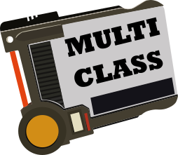

In my Notion API wrapper project that I'm working on, I decided to follow an OOP style for the different block types provided by Notion. I found myself needing to inherit characteristics from various parent blocks, and JavaScript does not provide multi-inheritance out of the box for the `Class` syntactic sugar. This is a simple library that allows you to pass in a list of classes you wish to extend, and it gives back a single super class with all of those characteristics. 