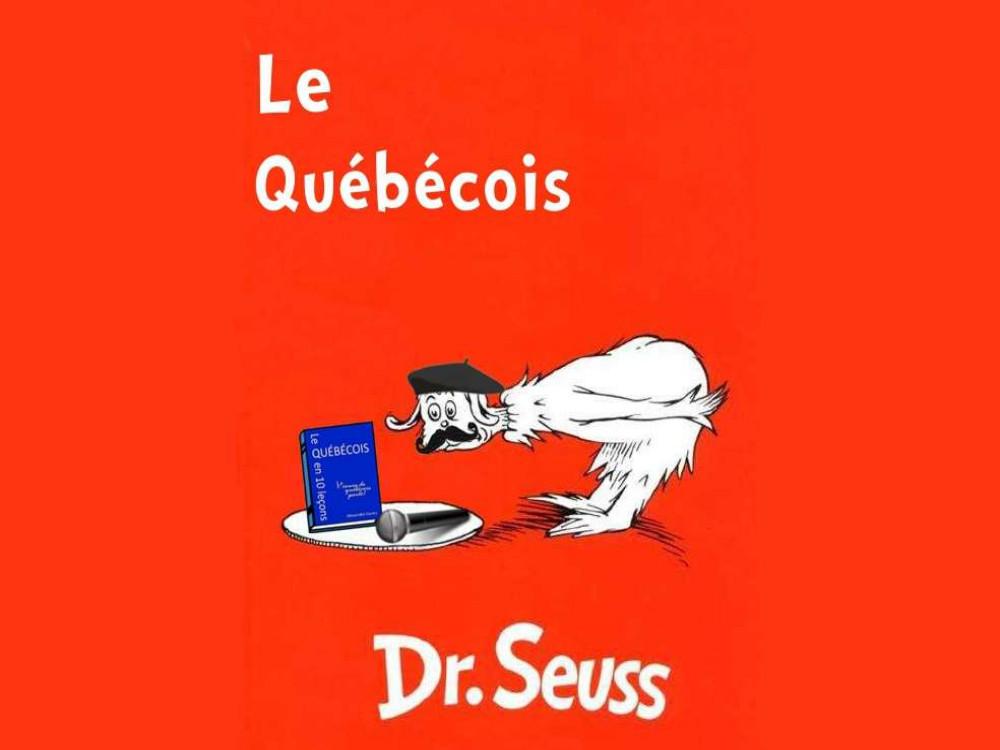

I created this, dare I say, masterpiece as a final project during my French 101 course at Johns Hopkins University in 2013. Our assignment was to create a slideshow showing some of the vocabulary we had learned that semester. During the course of the year I had become fascinated with the Québécois French dialect. The idea struck me as I was walking home from class, and I pulled two all-nighters (and neglected some other classwork) to work some amateur photoshop magic and write this parody of Green Eggs and Ham.