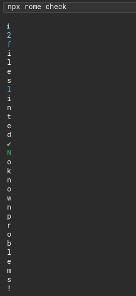
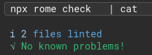

Have you ever wanted to string together some bash commands using pipes, but weren't sure how to not lose the error codes in the process?

---

tl;dr Add `set -o pipefail` to the beginning of your script!

---

For the [CircleCI Rome Orb](https://circleci.com/developer/orbs/orb/kbravh/rome) that I created, I was seeing very odd output to the pipeline logs for the commands. This was due to the way that the Rome linter streams its output. Each message was appearing one letter per line instead of showing the full message.

In order to alleviate this, I wanted to pipe my linting command through to `cat` to be displayed all at once instead of being streamed in character by character.

`npx rome check | cat`

---

Are you curious as to why we can't use `echo` here? The `echo` command only takes input from the arguments passed to it directly, not from stdin. If we used `echo` here, the console would only output a blank line!

---

However, just doing this piping would cause a problem in our script execution; if linting failed, the error code would just disappear! The problem stems from the fact that Bash does not always act like higher level programming languages. If a command fails, Bash will continue execution like normal. For a linting command, we want to get back our exit code so we know if linting failed without losing it in the pipe.

Luckily, there's a handy option for this.

`set -o pipefail`

By running `set -o pipefail` in our script before our pipe command, bash will finish executing the entire pipe and throw the error code of the right-most error that occurs, if any. So if `npx rome check` fails, that error code will still be thrown even though `cat` succeeds.

If you want to get some more in depth information and see some other good options to set for your bash scripts, check out [vaneyckt's great article](https://vaneyckt.io/posts/safer_bash_scripts_with_set_euxo_pipefail/).
