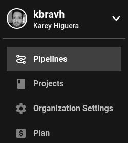
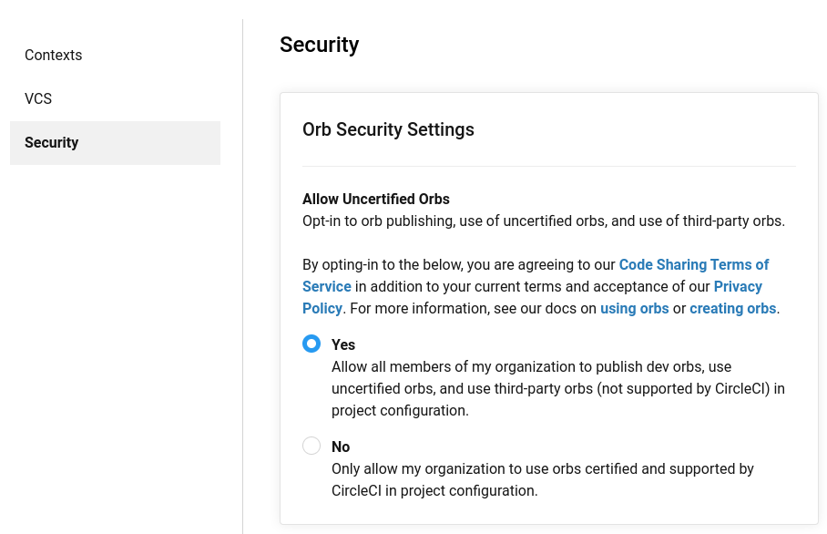
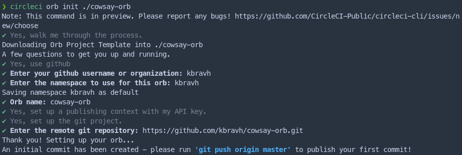
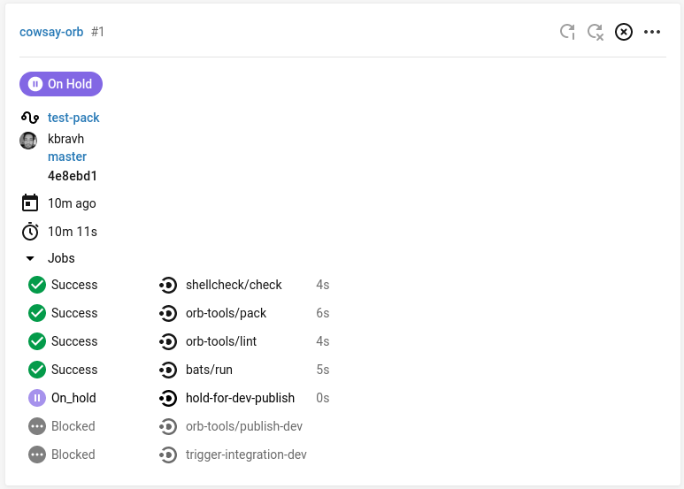
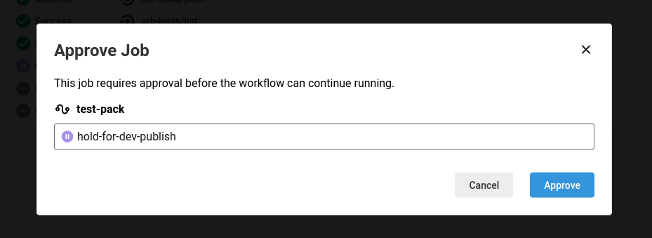
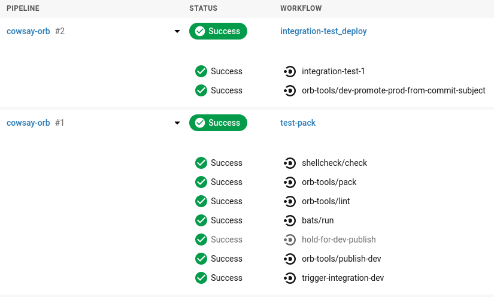
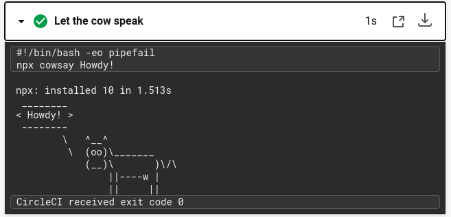
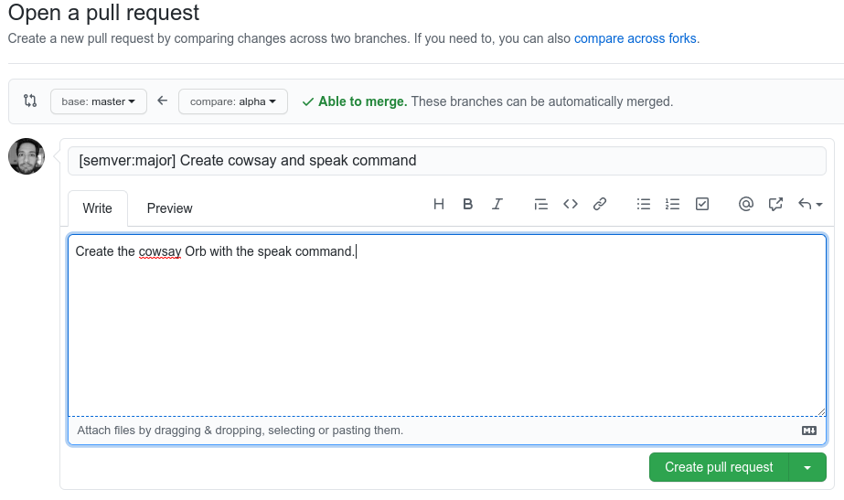
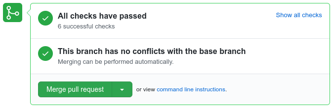

A guide for creating a CircleCI orb with the newly released [CircleCI Orb Development Kit](https://circleci.com/docs/2.0/orb-author/#orb-development-kit).

## Introduction to Orbs
CircleCI is a continuous integration tool that allows you to run packages of code called orbs against your code every time a commit is made to your repository, or every time a pull request is created or merged. This allows you to perform automated testing or other tasks to help maintain the quality of your projects.

CircleCI has just released a new tool, the Orb Development Kit, to simplify and streamline the process of creating new orbs. To demonstrate how to use the kit, we'll be creating a simple orb for `cowsay`, a CLI tool that has a cow say a message in your console.

```bash

❯ cowsay CircleCI is great!
 ____________________
< CircleCI is great! >
 --------------------
        \   ^__^
         \  (oo)\_______
            (__)\       )\/\
                ||----w |
                ||     ||

```

Though this particular cowsay orb is silly and a bit simple, creating a new orb that positively impacts developers and helps solve a challenge is a great way that you can contribute to Hacktoberfest! See the [CircleCI Hacktoberfest page](https://hacktoberfest.circleci.com/) for more details. Use this article as a guide and go out there and create something truly awesome.

##  Setup for Making an Orb
In order to use the new development kit, we need to [set up the CircleCI CLI](https://circleci.com/docs/2.0/local-cli/#installation). This command line tool provides a lot of handy tools that we can use for interacting with CircleCI and our pipelines.

In order to be able to create an orb, you must first enable it in your Organization Settings. Navigate to the [CircleCI Dashboard](https://circleci.com/dashboard) and on the menu on the left hand side of the screen, click Organization Settings.



Click on the Security tab and choose yes under **Allow Uncertified Orbs**. This will give you permission to publish orbs.



We will also need to create a GitHub repository for our new orb. You can head to the new repository page by clicking this fancy link: [github.new](https://github.new). Go ahead and leave the repository empty (don't add a README, license, or .gitignore file). Once you create it, take note of the git URL as the CLI will ask for it soon!

## Scaffolding Out the Orb
With the new orb development kit, much of the initial setup is taken care of for us as we only need to answer a few questions. Make sure that you are on a recent version of the CLI (at least `v0.1.10211`) to be able to use this new command. Run `circleci version` to see your current version, and `circleci update` to pull down a newer version if necessary.

To get started with the toolkit, run the command `circleci orb init <path to new orb>`. The path can be a new folder, and the tool will create it. For ours, let's create an orb named `cowsay-orb`, so our command will be `circleci orb init cowsay-orb`.

The toolkit will walk us through the steps to initialize and build out the orb. Follow the instructions as presented in the CLI; you will usually except the default options. See here a screenshot of my log:



Note that once you provide the GitHub link to the tool, it will create an initial commit for you locally and display the message `An initial commit has been created - please run 'git push origin master' to publish your first commit!.` Open a new terminal (don't cancel the toolkit process that's still running!), navigate to your new orb directory, and push the commit to GitHub.

```bash
cd cowsay-orb
git push origin master
```

Once you push the commit, return the toolkit and hit enter on `Done`. The toolkit will wrap up it's work and give you a URL to view your new orb's build pipeline! (Note: at the time of writing, the provided URL is incorrect. [See the issue](https://github.com/CircleCI-Public/circleci-cli/issues/478)) You can view your pipeline at `https://circleci.com/gh/<namespace>/<orb-name>`.

The pipeline is set up to require your manual action to actually publish versions of your orb. Head to the pipeline for your orb, and you'll see a purple message that says **On Hold**.



Click on the `hold-for-dev-publish` step that is next to the purple pause icon and click *Approve* to give the pipeline permission to publish the first test copy of your orb.



After a short time, the pipeline will finish running two jobs and your first development copy of the orb is now published!



Now, on to our actual development.

## Orb Layout

Open up your new orb directory in your code editor and ensure that you are not on the main branch. The toolkit should place you on the branch `alpha` automatically. You will always want to do your development on a separate branch like `alpha`, then merge that branch into your main branch later.

Let's take a look at the folder structure that was created for us.

```
.
├── .circleci
│   ├── config.yml
│   └── README.md
├── .git
│   └── ...
├── src
│   ├── commands
│   │   ├── greet.yml
│   │   └── README.md
│   ├── examples
│   │   ├── example.yml
│   │   └── README.md
│   ├── executors
│   │   ├── default.yml
│   │   └── README.md
│   ├── jobs
│   │   ├── hello.yml
│   │   └── README.md
│   ├── scripts
│   │   ├── greet.sh
│   │   └── README.md
│   ├── tests
│   │   ├── greet.bats
│   │   └── README.md
│   ├── @orb.yml
│   └── README.md
├── .gitignore
├── CHANGELOG.md
├── LICENSE
└── README.md
```

The `.circleci` directory contains administrative resources for the orb itself. We'll look at it in a bit more detail later on.

The `.git` directory provides some templates for GitHub issues and pull requests which you can customize if you like, but we won't discuss it in this article.

The `src` directory contains all of the different subdirectories that we'll be working in for this project. An orb can be made up of commands, examples, jobs, scripts, executors, and tests.
* [Commands](https://circleci.com/docs/2.0/orb-concepts/#usage-examples) are small, reusable pieces of functionality.
* [Examples](https://circleci.com/docs/2.0/orb-concepts/#usage-examples) are sample scripts that you provide to the user showing how to use your orb.
* [Jobs](https://circleci.com/docs/2.0/orb-concepts/#usage-examples) are longer processes made up of steps that can combine multiple commands to complete a task.
* [Scripts](https://circleci.com/docs/2.0/testing-orbs/) are pieces of code in other languages that can be used by your commands to accomplish more than what you could easily express in `yaml`, the language that the orbs are written in.
* [Executors](https://circleci.com/docs/2.0/orb-concepts/#usage-examples) are custom definitions of what type of "machine" or image you want your orb to be run on.
* [Tests](https://circleci.com/docs/2.0/testing-orbs/) and test resources can be placed in the test folder and executed by your integration tests.

For this simple orb that we are creating, we will not be defining jobs, scripts, executors, or separate tests, so those folders can safely be deleted. If you want to configure any of those yourself, look at the README provided in each folder, the examples provided, or the pages I have linked in the list above.

Open up the `@orb.yml` file located in the `src` folder. This is the main starting point for your orb. Whenever you publish the orb, the toolkit automatically takes each of the `.yml` files in your project and packs them together into one file. In this main `@orb.yml` file, you can define details about your orb and import any other orbs you might need.

Let's look at our fields here:
* `version` - the configuration file version that we are using. This will be 2.1, the latest.
*  `description` - should be a short and sweet snippet about what our orb will do.
*  `home_url` - a reference to the home page of the tool we're building an orb for.
*   `display_url` - a reference to our GitHub repository for this orb.
*   `orbs` - any other orbs that we'll pull in to our project.

Our `@orb.yml` will look like this:

```yaml

version: 2.1

description: >
  A simple CircleCI Orb to bring some beef to your logs.

display:
  home_url: "https://en.wikipedia.org/wiki/Cowsay"
  source_url: "https://github.com/kbravh/cowsay-orb"

orbs:
  node: circleci/node@4.0.1

```

We're now ready to develop our orb functionality!

## Create Our Orb's Command

Open up the `commands` directory. We can open the `greet.yml` to learn what a command should look like.

⚠️ Note: From here on out, we'll be writing YAML, which is indent dependent and is *very* picky (especially with the YAML linter that is built into the toolkit). If you run into errors, please check the following:
* Ensure your indentations are correct.
* There shouldn't be any whitespace at the end of lines. The [Trailing Spaces VS Code extension](https://marketplace.visualstudio.com/items?itemName=shardulm94.trailing-spaces) is very helpful here.
* There **must** be a blank line at the end of every YAML file.

```yaml

description: >
  This command echos "Hello World" using file inclusion.
# What will this command do?
# Descriptions should be short, simple, and clear.
parameters:
  to:
    type: string
    default: "World"
    description: "Hello to whom?"
steps:
  - run:
      environment:
        PARAM_TO: <<parameters.to>>
      name: Hello Greeting
      command: <<include(scripts/greet.sh)>>

```

* The `description` should succinctly describe what this command will do.
* The `parameters` section defines arguments that we can pass to our orb to let the user customize what it will do.
* The `steps` are the individual commands that will be run. Notice that any parameters that we define above can be referenced using double angle brackets `<< parameters.<name> >>`  and the parameter's name using dot notation.

Let's change the name of this file to `speak.yml`. The names of the files in the command folder will become the actual commands available for our orb. We can now build out our own functionality. We'll inform the user that this `speak` command will have a cow say a command in the logs.

```yaml

description: >
  This command will have a cow say a message in your logs.

```

Next, let's provide a parameter for the message the cow will say. The name of the parameter is the first line written under `parameters`. We can define a type (`string`, `boolean`, `enum`) and also define a `default` value in case the user does not pass one. If defaults are not provided, the job will fail for any missing parameters.

```yaml

parameters:
  message:
    type: string
	default: "Mooo!"
	description: "What will the cow say?"

```

Finally, let's the define the steps of this command itself. The `run` operator will let us run a command as if we were typing in the terminal. We can provide a `name` for the command, and then pass the `command` itself. We'll need to run the command `npx cowsay` to fetch the cowsay package, and then we pass in the message from our parameters. By passing the `-q` flag to `npx`, we can have it be quiet and not print any of its own output, like download times.

```yaml

steps:
  - run:
      name: Let the cow speak
      command: npx -q cowsay << parameters.message >>

```

That's all there is to defining a small command! So our `speak.yml` file will come together to look like this:

```yaml

description: >
  This command will have a cow say a message in your logs.
parameters:
  message:
    type: string
    default: "Mooo!"
    description: "What will the cow say?"
steps:
  - run:
      name: Let the cow speak
      command: npx -q cowsay << parameters.message >>

```

## Define an Integration test
Now that we have our command written, let's create an integration test. This will serve to make sure our orb command runs correctly, and we can also use this as the basis for our example.

Navigate to the `.circleci` folder and open `config.yml`. The toolkit uses this configuration to publish development and production versions of our orb. We can clean up this file a bit to accommodate our orb. Under the `orbs` heading, let's add the `node` orb.

```yaml
orbs:
  node: circleci/node@4.0.1
```

As we haven't included any Bash scripts, we can remove the `bats` and `shellcheck` orbs. This means we should also head down to the `workflows` section and remove the `shellcheck/check` and the `bats/run` commands. Since we no longer have these jobs, we should also remove them from the `requires` list under the `hold-for-dev-publish` job.

Now, let's define our integration test. Under the `jobs` heading (which should be around line 22), remove everything beneath the `integration-test-1` command. We'll add our own configuration here. We need to tell the job what environment to execute the job in, so set the `executor` to `node/default`, an executor defined in the `node` orb that comes with Node.js installed. We need Node.js to run the `npx cowsay` command. Then, define the steps we want the job to run. For us, this will just be our `cowsay/speak` command. Don't forget to pass in a message!

```yaml

jobs:
  # Define one or more jobs which will utilize your orb's commands and parameters to validate your changes.
  integration-test-1:
    executor: node/default
    steps:
      - cowsay/speak:
          message: "Howdy!"

```

This integration test is very basic and just ensures that our command can be run without throwing any errors or crashing the pipeline. See the [orb Testing Methodologies page](https://circleci.com/docs/2.0/testing-orbs/#integration-testing) for more information about testing.

⚠️ Note: Since the only published version of our orb that exists right now doesn't have our `speak` command that we created, this integration test will fail! To get around that for now, let's comment out the call to run `integration-test-1` under the `integration-test_deploy` job, and comment out the two `requires` lines under `orb-tools/dev-promote-prod-from-commit-subject`. We can re-enable it once we successfully run the pipeline. Our code sections will now appear like this:

```yaml
integration-test_deploy:
    when: << pipeline.parameters.run-integration-tests >>
    jobs:
      # Run any integration tests defined within the `jobs` key.
      # - integration-test-1

...

- orb-tools/dev-promote-prod-from-commit-subject:
	  orb-name: kbravh/cowsay-orb
	  context: orb-publishing
	  add-pr-comment: false
	  fail-if-semver-not-indicated: true
	  publish-version-tag: false
	  # requires:
	  #   - integration-test-1
	  filters:
		branches:
		  only: master
```

## Provide an Example

We can finally wrap up one of the last steps: writing an example for our users. This will resemble our integration test.

Open up the `examples` folder; you can delete the `example.yml`. Create a new file `congratulate.yml`, and let's start building out our example.

We can include a `description` just like in other files, so let's describe what will happen in this test.

```yaml

description: >
  Congratulate the user on the pipeline passing.

```

Next comes the `usage` tag. This is where we'll actually build out everything that will appear as the example for the user. We'll include the same version number `2.1`, and we'll list the orbs that we'll use. The development version of our orb is automatically tagged as `dev:alpha` by the toolkit, which is why we include it like that here. Once you have a published version of your orb, you can update this example with the actual version.

```yaml

usage:
  version: 2.1
  orbs:
    cowsay: kbravh/cowsay@dev:alpha
    node: circleci/node@4.0.1

```

Finally, we'll build out the job we would need to run. We can call it `congratulate`.  We define our `executor` just as we did in the integration test, and call our `cowsay/speak` command with a custom message.

```yaml

  jobs:
    congratulate:
      executor: node/default
      steps:
        - cowsay/speak:
            message: "Your pipeline looks great!"

```

We're finally ready to try out our orb!

## Testing and Publishing the Orb

Before we push our orb to the pipeline for testing, we can do a quick local validation using the `circleci orb validate`  tool in the CLI. This command will verify that our orb is formatted correctly. However, since our orb is currently split into many different files, we'll need to pack it together before validating. Both of these steps can be done using these two commands in your terminal.

```bash

circleci orb pack src/ > orb.yml
circleci orb validate orb.yml

```

The `pack` command squashes our various YAML files down into one consolidated orb file. Normally this command would just print the result out to the terminal, so we instead direct it into a file `orb.yml`. Then, our `validate` command checks our formatting.

---

Having any issues with YAML formatting? Try dropping your YAML files into this [YAML linter](http://www.yamllint.com/) to catch syntax errors.

---

If you see the message `Orb at 'orb.yml' is valid.` then you are ready to publish!

Publishing a development version is rather straightforward: you just need to push your changes to GitHub on your `alpha` branch!

Once you push your changes, head over to the pipeline at `https://circleci.com/gh/<namespace>/<orb-name>`. You'll have to click the **On Hold** button again to pass the job through. Once the pipeline finishes, you'll have a new dev version with your commands!

You can now re-enable your integration tests that we disabled above and push the code to GitHub once more. This will now run your integration test and publish another dev version. You can open the pipeline details and see the result of your integration test once it passes.



Once the pipeline finishes, you are finally ready to publish a live, production version of your orb!

## Publish a Production Orb
To start the process of upgrading your dev orb to a production version, you'll need to head over to GitHub and create a pull request from your `alpha` branch to your default branch. You have to include a special `[semver:<increment>]` tag in the title of your pull request. This is how the toolkit will know what version to assign to your orb when it is published. Check the following table to know what increment to include.

| Increment |            Description            |
|-----------|-----------------------------------|
|   major   | Issue a 1.0.0 incremented release |
|   minor   | Issue a x.1.0 incremented release |
|   patch   | Issue a x.x.1 incremented release |
|   skip    |      Do not issue a release       |

If we wanted our first version of our cowsay orb to be 0.0.1, we'd include `[semver:patch]` in the title. However, let's put `[semver:major]` so that our first version is 1.0.0.



After clicking **Create pull request**, you'll see a window below with a status. This window will show the status of the `alpha` pipeline, which should indicate that all the checks have passed. If everything is ready, you'll have the option to **Merge pull request**. It is recommended to click the small arrow next to the Merge button and choose to **Squash and merge**, as it will preserve your pull request title.



You'll be asked to confirm the merge. Make sure your semver tag is present still in the title! By merging in this pull request to your default branch, a final pipeline run will be started. Follow our same **On Hold** ritual from before and allow the pipeline to finish running.

Once the pipeline finishes, your orb should now be live! Visit it at `https://circleci.com/developer/orbs/orb/<namespace>/<orb-name>`. Note: If you try to search for your orb at the [Orb Registry](https://circleci.com/developer/orbs) and it can't be found, try waiting a little while before searching again. It seems to take a bit for new orbs to be indexed by the search engine.

Congratulations on making an orb! Hopefully this guide has been helpful. Go out there and do something awesome!

## Extra information
Want to make an orb private? Orbs are public by design, but you can unlist an orb so that it won't show up in the Registry. Learn how to [Unlist an orb](https://circleci-public.github.io/circleci-cli/circleci_orb_unlist.html).


<!-- Hero photo by Jamie Street https://unsplash.com/@jamie452 -->