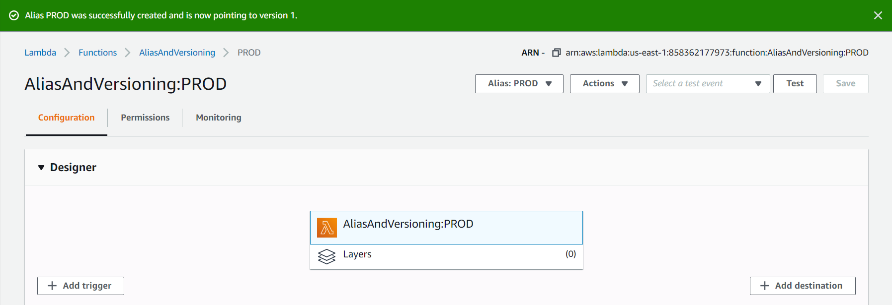

AWS Lambda provides a way to create versions of a function in order to test functionality in lower environments before moving it into higher environments. 

# Creating a version

First, create a new function or choose a function that you've already created. At the top of the page under the Actions dropdown, choose to publish a new version of your function.

You can add a description here to your version. This is essentially saving a snapshot of your function as it is now (like a git commit). 

You'll notice that the window says it is creating a new version from `js~$LATEST`. This is the tag that AWS gives to your current working state. Any changes you make to your function are saved in the `js~$LATEST` version even if you don't publish an explicit version yourself.

Once we publish our new version, we'll be taken to this new copy of our lambda function. We can tell what version we're on by the number appended to the function name. We can return to our `js~$LATEST` function version by using the Version dropdown or the breadcrumb trail at the top left.

We can't make changes to or publish a new version of this snapshot, so let's return to our `js~$LATEST` version and make a change to our code! We'll publish it as version 2.

There we go! We now have multiple versions of our functions that we can use for testing in different environments. These different versions can be referenced by using the ARN or function name with the version number appended like so: `js~AliasAndVersioning:2`. 

But what if we publish a third version and want a CloudWatch rule or an S3 trigger to point at our new version? With version numbers, we'd have to go and update the resource information with the new number each time. That's where aliases come in to save the day. 

# The Power of Aliases

Aliases are essentially nicknames or tags that we can point at certain versions of our function. When we create a new version of our function, we can simply move our alias to point there instead. Let's see it in action. 

## Creating a Production alias

Under the Actions dropdown, choose to create an alias. Here we can set the name, a description, and which version we'll point the alias at. Let's set `js~PROD` (Production) at version 1 that we created. 

The weighted alias section at the bottom allows you to divert a percentage of your traffic to different versions of your function, like for A/B testing.

When we save this alias, we'll see a screen very similar to what we saw when we created a new version, but the alias name is now appended to the function name instead of the version number!

## Creating a Development alias

Let's now create a DEV (development) alias. Instead of pointing this at a version number, we can point it directly at `js~$LATEST` to always reflect our latest changes. 

Now we have our aliases for our different development environments! So when I reference this function while setting up any other resources, I can reference the alias of the function like `js~AliasAndVersioning:DEV`.

## Update alias reference

Let's say that we've finished testing version 2 of our function in the development environment and we're ready to use it in Production. If we have our references set up to point to the alias, it's as easy as just adjusting the alias definition.

Let's choose our `js~PROD` alias from the Alias dropdown so that we can edit its settings. In the Alias configuration box at the bottom, click the Edit button.

From the version dropdown on the page, we can now choose version 2 and save our changes. 

Production will now be using our newer version! 🎉

Hero photo by <a class="unsplash-credit" style="background-color:black;color:white;text-decoration:none;padding:4px 6px;font-family:-apple-system, BlinkMacSystemFont, &quot;San Francisco&quot;, &quot;Helvetica Neue&quot;, Helvetica, Ubuntu, Roboto, Noto, &quot;Segoe UI&quot;, Arial, sans-serif;font-size:12px;font-weight:bold;line-height:1.2;display:inline-block;border-radius:3px" href="https://unsplash.com/@brett_jordan?utm_medium=referral&amp;utm_campaign=photographer-credit&amp;utm_content=creditBadge" target="_blank" rel="noopener noreferrer" title="High-resolution photos from Aron Visuals"><svg xmlns="http://www.w3.org/2000/svg" style="height:12px;width:auto;position:relative;vertical-align:middle;top:-2px;fill:white" viewBox="0 0 32 32"><title>unsplash-logo</title><path d="M10 9V0h12v9H10zm12 5h10v18H0V14h10v9h12v-9z"></path></svg>Brett Jordan</a>